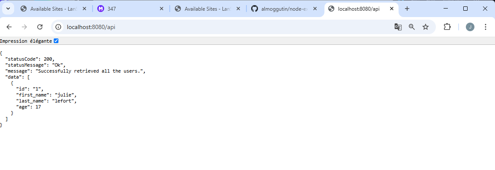

Veuillez écrire votre documentation technique dans ce document !
# Documentation technique
## Analyse
Cette application utilise une base de données et une application Node.js pour fonctionner.
On a un répertoire source qui contient les fichiers de l'application.
Les dépendances sont dans le package.json et celles dont l'application a besoin pour fonctionner sont :
- config
- cors
- dotenv
- express
- mysql2

Le package.json définit aussi 2 scripts, un start qui lance index.js en production sur node et dev qui lance index.js en developpement sur node.js

## Déploiement
Pour la base de données, j'ai utilisé l'image mysql:5.7 comme précisé dans la consigne.
Puis, j'ai défini les variables d'environnement et j'ai créé 2 volumes, un pour le stockage des données (mysql-data) et un qui utilisait mon répertoire sql (qui contenait mon script) pour initialiser la base de données lors du premier docker-compose up.  

Puis pour le backend, j'ai d'abord créé un Dockerfile qui clonait le répertoire git dans le workdir/app, ensuite j'ai installé les dépendances grace à npm install et ensuite un lancement de l'application grace au script dev du package.json.  

Dans le docker-compose, j'ai utilisé le Dockerfile pour créer l'image, ensuite j'ai défini les variables d'environnement qu'on peut retrouver dans config/default.js dans le répo de l'application. Pour les valeurs j'ai repris celles définies pour la base de données et j'ai mis une dépendance sur la base de données. 

Ensuite j'ai juste déclaré le volume mysql-data,  

Pour le lancement de l'application, j'ai utilisé un docker-compose up db puis un docker-compose up backend, car si on fait les 2 en même temps, le backend essayait de se connecter à la base de données avant qu'elle ait terminé sa création et ça donnait une erreur.

## Problèmes rencontrés
- *Problème:* erreur lors de l'exécution de init-db.sql, la base de données existe déjà  
  *Solution:* correction du script, j'avais repris celui du github qui contenait CREATE DATABASE api_example;, alors qu'elle se créait déjà par elle même

- *Problème:* ma requête INSERT est incorrect, il manque l'id  
  *Solution:* ajouter le champ id dans la requête INSERT

- *Problème:* erreur node.js qui ne trouve pas un package /app/nom  
  *Solution:* installation des dépendances corrects ( RUN npm install -g nodemon cross-env ) et correction de la syntaxe (ajout d'un . à la fin du RUN git clone)

- *Problème*: au lancement du backend, il indique une erreur de connexion à la db
  *Solution:* lancer le backend en 2ème pour s'assurer que la base de données est bien initialisées

## Résultat
Une fois l'application lancée, accéder à l'application sur http://localhost:8080/api et vérifier le fonctionnement.  
Résultat de mon application:
